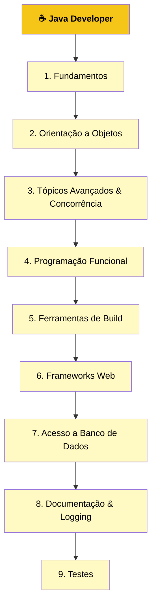

# ☕ Roadmap Java

Trilha de estudos estruturada para formação em desenvolvimento Java, documentada em português. Baseada no [roadmap.sh/java](https://roadmap.sh/java) como referência inicial, com **organização e conteúdo próprios**.

## 🗺️ Visão Geral da Trilha

O roadmap é dividido em **9 grandes etapas**, percorridas de forma sequencial:

---

### 1. Fundamentos

- [x] [Programação Orientada a Objetos em Java](fundamentos/objetos_classes_interfaces_pacores_herancas) Fundamentos da Programação Orientada a Objetos (POO) em Java: objetos, classes, herança, interfaces e pacotes.
- [x] [Variáveis em Java](fundamentos/variaveis_em_java) Sintaxe para criar e inicializar variáveis de tipo primitivo.
    - [x] [Tipos de Dados Primitivos em Java](fundamentos/variaveis_em_java/tipos_de_dados_primitivos_em_java)
    - [x] [Arrays](fundamentos/variaveis_em_java/arrays)
    - [x] [📘 Questões e Exercícios](fundamentos/variaveis_em_java/questoes_e_exercicios)
- [x] [Operdadores](fundamentos/operadores)
    - [x] [Atribuição, Operadores Aritméticos e Unários](fundamentos/operadores/atribuicao_op_aritmeticos_unarios)
    - [x] [Operadores de Igualdade, Relacionais e Condicionais](fundamentos/operadores/op_igualdade_condicionaiis_relacionais)
    - [x] [Operadores Bitwise e de Deslocamento de Bits](fundamentos/operadores/op_bitwise_deslocamento)
    - [x] [📘 Questões e Exercícios](fundamentos/operadores/questoes_e_exercicios)
- [x] [Expressões, Declarações e Blocos](fundamentos/expressoes_declaracoes_blocos)
    - [x] [📘 Questões e Exercícios](fundamentos/expressoes_declaracoes_blocos/)
- [x] [Declarações de Controle de Fluxo](fundamentos/declaracoes_de_controle_de_fluxo)
    - [x] [As instruções if-then e if-then-else](fundamentos/declaracoes_de_controle_de_fluxo/instrucoes_ifthen_e_ifthenelse)
    - [x] [A Instrução switch](fundamentos/declaracoes_de_controle_de_fluxo/instrucao_switch)
    - [x] [As instruções while e do-while](fundamentos/declaracoes_de_controle_de_fluxo/instrucoes_while_e_dowhile)
    - [x] [A Instrução for](/fundamentos/declaracoes_de_controle_de_fluxo/instrucao_for)
    - [x] [Declarações de Ramificação](fundamentos/declaracoes_de_controle_de_fluxo/declaracoes_de_ramificacao)
    - [x] [📘 Questões e Exercícios](fundamentos/declaracoes_de_controle_de_fluxo/questoes_e_exercicios)

#### Aprofundamentos:

- [x] [Ciclo de Vida de um Programa Java](fundamentos/ciclo_de_vida)
- [x] [Variáveis em Java](fundamentos/aprofundamentos/variaveis_em_java)
- [x] [Tipos de Dados](fundamentos/aprofundamentos/tipos_de_dados_em_java)
- [x] [Escopo de Variáveis](fundamentos/aprofundamentos/escopo_de_variaveis)
- [x] [Casting de Tipos](fundamentos/aprofundamentos/casting_de_tipos) 
- [x] [Strings e Métodos](fundamentos/aprofundamentos/strings_e_metodos)
- [x] [Operações Matemáticas](./fundamentos/aprofundamentos/operacoes_matematicas)
- [x] [Arrays](./fundamentos/aprofundamentos/arrays) 
- [x] [Condicionais](./fundamentos/aprofundamentos/condicionais)
- [x] [Laços de Repetição](./fundamentos/aprofundamentos/lacos_de_repeticao)
- [x] [Introdução à OOP](./fundamentos/aprofundamentos/introducao_a_oop)

---

### 2. Orientação a Objetos

**Conceitos Base:**

- [x] [Classes e Objetos](./orientacao_a_objetos/conceitos_base/classes_e_objetos)
- [x] [Atributos e Métodos](./orientacao_a_objetos/conceitos_base/atributos_e_metodos)
    - [x] [Classes](./orientacao_a_objetos/conceitos_base/atributos_e_metodos/classes/)
    - [x] [Métodos](./orientacao_a_objetos/conceitos_base/atributos_e_metodos/metodos/)
    - [x] [Propriedades](./orientacao_a_objetos/conceitos_base/atributos_e_metodos/propriedades/) 
- [x] [Modificadores de Acesso](./orientacao_a_objetos/conceitos_base/modificadores_de_acesso) (private, default, protected, public) ✓
- [x] [Palavra-chave `static`](./orientacao_a_objetos/conceitos_base/palavrachave_static)
    - [x] [Palavra-chave `static` em Java explicada com exemplos](./orientacao_a_objetos/conceitos_base/palavrachave_static/palavrachave_static_com_exemplos/) ✓
    - [x] [Campos estáticos, não estáticos (e `final`) em Java](./orientacao_a_objetos/conceitos_base/palavrachave_static/campos_estatico_e_naoestatico/) ✓
    - [x] [Guia da palavra-chave `static` em Java](./orientacao_a_objetos/conceitos_base/palavrachave_static/guia_para_palavrachave_static/) ✓
- [x] [Palavra-chave `final`](./orientacao_a_objetos/conceitos_base/palavrachave_final/) (apresentação)
    - [x] [Palavra-chave `final`](./orientacao_a_objetos/conceitos_base/palavrachave_final/palavrachave_final/) (detalhamento)
    - [x] [Como funciona a palavra-chave final em Java?](./orientacao_a_objetos/conceitos_base/palavrachave_final/como_funciona_a_palavrachave_final_em_java/)
- [x] [Classes Aninhadas - Conceito](./orientacao_a_objetos/conceitos_base/classes_aninhadas/)
    - [x] [Classes Aninhadas em Java](./orientacao_a_objetos/conceitos_base/classes_aninhadas/classes_aninhadas_em_java/)
    - [x] [Guia para Classes Aninhadas](./orientacao_a_objetos/conceitos_base/classes_aninhadas/guia_para_classes_aninhadas/)
- [ ] Pacotes (`packages`)

**Aprofundando em OOP**
- [ ] Ciclo de Vida de Objetos
- [ ] Herança
- [ ] Abstração
- [ ] Encapsulamento
- [ ] Interfaces
- [ ] Enums
- [ ] Records
- [ ] Method Chaining
- [ ] Sobrecarga e Sobrescrita de Métodos
- [ ] Bloco Inicializador
- [ ] Binding Estático vs Dinâmico
- [ ] Passagem por Valor / Passagem por Referência

**Recursos Modernos**
- [ ] Tratamento de Exceções
- [ ] Expressões Lambda
- [ ] Anotações (`Annotations`)
- [ ] Módulos
- [ ] Optionals

---

### 3. Tópicos Avançados & Concorrência

**Utilitários**
- [ ] Criptografia
- [ ] Data e Hora (`java.time`)
- [ ] Redes (`Networking`)
- [ ] Expressões Regulares

**Concorrência**
- [ ] Palavra-chave `volatile`
- [ ] Java Memory Model
- [ ] Threads
- [ ] Threads Virtuais (Project Loom)

**Coleções**
- [ ] Arrays vs ArrayList
- [ ] Set
- [ ] Map
- [ ] Queue e Deque
- [ ] Stack
- [ ] Iterator
- [ ] Coleções Genéricas

**Outros**
- [ ] Injeção de Dependência
- [ ] Operações de I/O
- [ ] Operações com Arquivos

---

### 4. Programação Funcional

- [ ] Funções de Alta Ordem
- [ ] Interfaces Funcionais
- [ ] Composição Funcional
- [ ] Stream API

---

### 5. Ferramentas de Build

- [ ] Maven
- [ ] Gradle
- [ ] Bazel

---

### 6. Frameworks Web

- [ ] Spring Boot ⭐ *(recomendado pelo roadmap)*
- [ ] Quarkus
- [ ] Javalin
- [ ] Play Framework

---

### 7. Acesso a Banco de Dados

- [ ] JDBC
- [ ] Hibernate
- [ ] Spring Data JPA
- [ ] Ebean

---

### 8. Documentação & Logging

**Documentação**
- [ ] Javadoc

**Frameworks de Logging**
- [ ] Logback
- [ ] Log4j
- [ ] SLF4J
- [ ] TinyLog

---

### 9. Testes

**Frameworks**
- [ ] JUnit
- [ ] TestNG
- [ ] REST Assured
- [ ] Cucumber-JVM (BDD)
- [ ] JMeter

**Conceitos**
- [ ] Testes Unitários
- [ ] Testes de Integração
- [ ] Testes de Comportamento (Behavior Testing)
- [ ] Mocking com Mockito

---

## Referências

| Recurso | Link |
|---|---|
| Roadmap original | [roadmap.sh/java](https://roadmap.sh/java) |
| Documentação oficial Java | [docs.oracle.com/java](https://docs.oracle.com/en/java/) |
| OpenJDK | [openjdk.org](https://openjdk.org/) |

