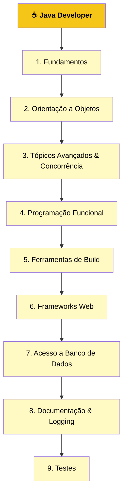

# ☕ Roadmap Java

Trilha de estudos estruturada para formação em desenvolvimento Java, documentada em português. Baseada no [roadmap.sh/java](https://roadmap.sh/java) como referência inicial, com organização e conteúdo próprios.

## 🗺️ Visão Geral da Trilha

O roadmap é dividido em **9 grandes etapas**, percorridas de forma sequencial:



---

### 1. Fundamentos

- [x] [Programação Orientada a Objetos em Java](fundamentos/objetos_classes_interfaces_pacores_herancas) Fundamentos da Programação Orientada a Objetos (POO) em Java: objetos, classes, herança, interfaces e pacotes.
- [x] [Variáveis em Java](fundamentos/variaveis_em_java) Sintaxe para criar e inicializar variáveis de tipo primitivo.
    - [x] [Tipos de Dados Primitivos em Java](fundamentos/variaveis_em_java/tipos_de_dados_primitivos_em_java)
    - [x] [Arrays](fundamentos/variaveis_em_java/arrays)
    - [x] [Questões e Exercícios](fundamentos/variaveis_em_java/questoes_e_exercicios)
- [x] [Operdadores](fundamentos/operadores)
    - [x] [Atribuição, Operadores Aritméticos e Unários](fundamentos/operadores/atribuicao_op_aritmeticos_unarios)
    - [x] [Operadores de Igualdade, Relacionais e Condicionais](fundamentos/operadores/op_igualdade_condicionaiis_relacionais)
    - [x] []()
- [x] [Ciclo de Vida de um Programa Java](fundamentos/ciclo_de_vida)
- [ ] Tipos de Dados
- [ ] Variáveis e Escopos
- [ ] Casting de Tipos
- [ ] Strings e Métodos
- [ ] Operações Matemáticas
- [ ] Arrays 
- [ ] Condicionais
- [ ] Laços de Repetição
- [ ] Introdução à OOP

---

### 2. Orientação a Objetos

**Conceitos Base**
- [ ] Classes e Objetos
- [ ] Atributos e Métodos
- [ ] Modificadores de Acesso
- [ ] Palavra-chave `static`
- [ ] Palavra-chave `final`
- [ ] Classes Aninhadas
- [ ] Pacotes (`packages`)

**Aprofundando em OOP**
- [ ] Ciclo de Vida de Objetos
- [ ] Herança
- [ ] Abstração
- [ ] Encapsulamento
- [ ] Interfaces
- [ ] Enums
- [ ] Records
- [ ] Method Chaining
- [ ] Sobrecarga e Sobrescrita de Métodos
- [ ] Bloco Inicializador
- [ ] Binding Estático vs Dinâmico
- [ ] Passagem por Valor / Passagem por Referência

**Recursos Modernos**
- [ ] Tratamento de Exceções
- [ ] Expressões Lambda
- [ ] Anotações (`Annotations`)
- [ ] Módulos
- [ ] Optionals

---

### 3. Tópicos Avançados & Concorrência

**Utilitários**
- [ ] Criptografia
- [ ] Data e Hora (`java.time`)
- [ ] Redes (`Networking`)
- [ ] Expressões Regulares

**Concorrência**
- [ ] Palavra-chave `volatile`
- [ ] Java Memory Model
- [ ] Threads
- [ ] Threads Virtuais (Project Loom)

**Coleções**
- [ ] Arrays vs ArrayList
- [ ] Set
- [ ] Map
- [ ] Queue e Deque
- [ ] Stack
- [ ] Iterator
- [ ] Coleções Genéricas

**Outros**
- [ ] Injeção de Dependência
- [ ] Operações de I/O
- [ ] Operações com Arquivos

---

### 4. Programação Funcional

- [ ] Funções de Alta Ordem
- [ ] Interfaces Funcionais
- [ ] Composição Funcional
- [ ] Stream API

---

### 5. Ferramentas de Build

- [ ] Maven
- [ ] Gradle
- [ ] Bazel

---

### 6. Frameworks Web

- [ ] Spring Boot ⭐ *(recomendado pelo roadmap)*
- [ ] Quarkus
- [ ] Javalin
- [ ] Play Framework

---

### 7. Acesso a Banco de Dados

- [ ] JDBC
- [ ] Hibernate
- [ ] Spring Data JPA
- [ ] Ebean

---

### 8. Documentação & Logging

**Documentação**
- [ ] Javadoc

**Frameworks de Logging**
- [ ] Logback
- [ ] Log4j
- [ ] SLF4J
- [ ] TinyLog

---

### 9. Testes

**Frameworks**
- [ ] JUnit
- [ ] TestNG
- [ ] REST Assured
- [ ] Cucumber-JVM (BDD)
- [ ] JMeter

**Conceitos**
- [ ] Testes Unitários
- [ ] Testes de Integração
- [ ] Testes de Comportamento (Behavior Testing)
- [ ] Mocking com Mockito

---

## 📁 Estrutura do Repositório

```
roadmap_java_dev/
│
├── README.md                   ← você está aqui
│
├── 01-fundamentos/
│   ├── README.md               ← resumo da etapa
│   ├── sintaxe-basica/
│   ├── tipos-de-dados/
│   └── ...
│
├── 02-oop/
│   └── ...
│
├── 03-avancado/
│   └── ...
│
├── 04-funcional/
│   └── ...
│
├── 05-build-tools/
│   └── ...
│
├── 06-frameworks-web/
│   └── ...
│
├── 07-banco-de-dados/
│   └── ...
│
├── 08-documentacao-logging/
│   └── ...
│
└── 09-testes/
    └── ...
```

Cada subpasta de tópico segue o padrão:

```
sintaxe-basica/
├── README.md       ← teoria, explicações, anotações pessoais
├── exemplos/       ← arquivos .java com código comentado
└── exercicios/     ← desafios resolvidos
```

---

## Referências

| Recurso | Link |
|---|---|
| Roadmap original | [roadmap.sh/java](https://roadmap.sh/java) |
| Documentação oficial Java | [docs.oracle.com/java](https://docs.oracle.com/en/java/) |
| OpenJDK | [openjdk.org](https://openjdk.org/) |

---

## Status Geral

| Etapa | Tópicos | Concluídos | Progresso |
|---|---|---|---|
| 1. Fundamentos | 11 | 0 | `░░░░░░░░░░` 0% |
| 2. Orientação a Objetos | 22 | 0 | `░░░░░░░░░░` 0% |
| 3. Avançado & Concorrência | 17 | 0 | `░░░░░░░░░░` 0% |
| 4. Programação Funcional | 4 | 0 | `░░░░░░░░░░` 0% |
| 5. Ferramentas de Build | 3 | 0 | `░░░░░░░░░░` 0% |
| 6. Frameworks Web | 4 | 0 | `░░░░░░░░░░` 0% |
| 7. Banco de Dados | 4 | 0 | `░░░░░░░░░░` 0% |
| 8. Documentação & Logging | 5 | 0 | `░░░░░░░░░░` 0% |
| 9. Testes | 9 | 0 | `░░░░░░░░░░` 0% |
| **Total** | **79** | **0** | `░░░░░░░░░░` **0%** |

