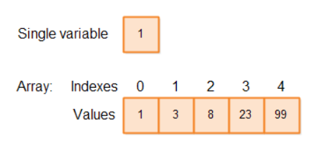

# Arrays em Java

Um Array em Java é uma coleção de variáveis do mesmo tipo. Por exemplo, um array de `int` é uma coleção de variáveis do tipo `int`. As variáveis no array são ordenadas e cada uma possui um índice. Você verá como indexar em um array mais adiante neste texto.  

Aqui está uma ilustração de arrays em Java:

<p align="center">
  
</p>

## Declarando uma Variável de Array em Java

Uma variável de array em Java é declarada da mesma forma que você declararia uma variável do tipo desejado, exceto que você adiciona `[]` após o tipo.  

Exemplo simples de declaração de array em Java:

```java
int[] intArray;
```

Você pode usar um array em Java como campo, campo estático, variável local ou parâmetro, assim como qualquer outra variável.  

Aqui estão mais alguns exemplos de declaração de arrays em Java:

```java
String[] stringArray;
MyClass[] myClassArray;
```

A primeira linha declara um array de referências `String`. A segunda linha declara um array de referências para objetos da classe `MyClass`.  

Você pode escolher onde colocar os colchetes `[]` ao declarar um array em Java. Ambos os estilos são válidos:

```java
int[] intArray;
int intArray[];
String[] stringArray;
String stringArray[];
MyClass[] myClassArray;
MyClass myClassArray[];
```

É preferível colocar os colchetes `[]` após o tipo de dado (ex.: `String[]`) e não após o nome da variável.

## Instanciando um Array em Java

Ao declarar uma variável de array em Java, você apenas declara a referência ao array. A declaração não cria o array.  

Você cria um array assim:

```java
int[] intArray;
intArray = new int[10];
```

Este exemplo cria um array do tipo `int` com espaço para 10 variáveis `int`.

Também é possível criar arrays de referências a objetos:

```java
String[] stringArray = new String[10];
```

## Literais de Array em Java

A linguagem Java contém um atalho para instanciar arrays de tipos primitivos e strings.  

Exemplo:

```java
int[] ints2 = new int[]{ 1,2,3,4,5,6,7,8,9,10 };
```

Ou simplesmente:

```java
int[] ints2 = { 1,2,3,4,5,6,7,8,9,10 };
```

Exemplo com strings:

```java
String[] strings = {"one", "two", "three"};
```

## O Tamanho de um Array Não Pode Ser Alterado

Uma vez criado, o tamanho de um array não pode ser redimensionado. Se você precisa de uma estrutura semelhante a array que possa mudar de tamanho, use uma `List`.

## Acessando Elementos de um Array

Cada variável em um array é chamada de **elemento**.  

Exemplo:

```java
intArray[0] = 0;
int firstInt = intArray[0];
```

Os índices começam em 0 e vão até `tamanho - 1`.


## Comprimento de um Array

Você acessa o comprimento de um array via o campo `length`:

```java
int[] intArray = new int[10];
int arrayLength = intArray.length;
```

## Iterando Arrays

Você pode percorrer todos os elementos de um array usando `for` ou `for-each`.

Exemplo com `for`:

```java
for(int i=0; i < stringArray.length; i++) {
    System.out.println(stringArray[i]);
}
```

Exemplo com `for-each`:

```java
for(String theString : stringArray) {
    System.out.println(theString);
}
```

## Arrays Multidimensionais em Java

Você pode criar arrays com múltiplas dimensões:

```java
int[][] intArray = new int[10][20];
```

Acessando elementos:

```java
intArray[0][2] = 129;
int oneInt = intArray[0][2];
```

## Inserindo Elementos em um Array

```java
int[] ints = new int[20];
int insertIndex = 10;
int newValue = 123;

for(int i=ints.length-1; i > insertIndex; i--){
    ints[i] = ints[i-1];
}
ints[insertIndex] = newValue;
```

## Removendo Elementos de um Array

```java
int[] ints = new int[20];
ints[10] = 123;
int removeIndex = 10;

for(int i = removeIndex; i < ints.length -1; i++){
    ints[i] = ints[i+1];
}
```

## Encontrando Valores Mínimos e Máximos

Exemplo para mínimo:

```java
int[] ints = {0,2,4,6,8,10};
int minVal = Integer.MAX_VALUE;

for(int i=0; i < ints.length; i++){
    if(ints[i] < minVal){
        minVal = ints[i];
    }
}
```

Exemplo para máximo:

```java
int maxVal = Integer.MIN_VALUE;
for(int i=0; i < ints.length; i++){
    if(ints[i] > maxVal){
        maxVal = ints[i];
    }
}
```

## A Classe Arrays

A classe `java.util.Arrays` fornece métodos utilitários para copiar, ordenar, preencher, buscar e comparar arrays.

Exemplo de ordenação:

```java
java.util.Arrays.sort(ints);
```

Exemplo de comparação:

```java
boolean equals = Arrays.equals(ints1, ints2);
```
