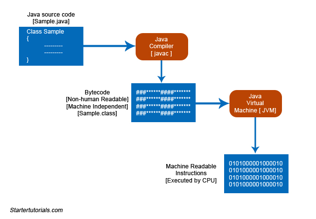

# Ciclo de vida de um programa Java

O ciclo de vida de um programa Java nos mostra o que acontece desde o momento em que digitamos o código-fonte em um editor de texto até o ponto em que esse código é convertido em código de máquina (0’s e 1’s).

  

Existem três etapas principais no ciclo de vida de um programa Java. São elas:

- **Edição do programa**  
- **Compilação do código-fonte**  
- **Execução do bytecode**

## 1. Edição do programa
Primeiro, você começa digitando o programa em um editor de texto (ex: notepad, notepad++, wordpad, textedit etc).  
Após concluir a edição do programa, precisamos salvar o arquivo.  
Ao salvar o arquivo, você deve lembrar que ele precisa ser salvo com a extensão **.java**.

**Exemplo:**  
Suponha que eu tenha escrito um programa Java que contém uma única classe chamada `Sample` (mais sobre classes em posts futuros).  
É uma boa convenção salvar o arquivo com o nome da classe.  
Portanto, conforme o exemplo, o arquivo será salvo como **Sample.java**.

## 2. Compilação do código-fonte
O segundo passo é a compilação.  
O nome do compilador Java é **javac**.  
A entrada para o compilador é o código-fonte Java, que está disponível em **Sample.java**.  
A saída do compilador é um código independente de máquina ou independente de plataforma, conhecido como **bytecode**.  

O arquivo gerado após a compilação é um arquivo **.class**.  
Conforme o exemplo, o arquivo de bytecode será **Sample.class**.

## 3. Execução do bytecode
O último passo é a execução.  
O bytecode gerado pelo compilador será executado pela **Java Virtual Machine (JVM)**.  
A entrada da JVM é o bytecode e a saída é o **código de máquina (0’s e 1’s)**, que será executado pela CPU da máquina local.

