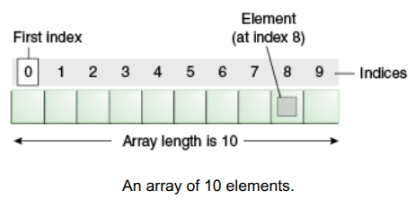

# Arrays

Um *array* é um objeto recipiente que contém um número fixo de valores de um único tipo. O comprimento de um array é estabelecido quando o array é criado. Após a criação, o seu comprimento é fixo. Você já viu um exemplo de arrays antes, no método `main` da aplicação "Hello World!". Esta seção discute arrays em maior detalhe.

<p align="center">
  
</p>

<center>An array of 10 elements.</center>

Cada item em um array é chamado de *elemento*, e cada elemento é acessado pelo seu *índice numérico*. Como mostrado na ilustração anterior, a numeração começa em 0. O 9º elemento, por exemplo, seria portanto acessado no índice 8.

O programa a seguir, `ArrayDemo`, cria um array de inteiros, coloca alguns valores nele e imprime cada valor no console.

```java
class ArrayDemo {
    public static void main(String[] args) {
        // declara um array de inteiros
        int[] anArray;

        // aloca memória para 10 inteiros
        anArray = new int;
           
        // inicializa o primeiro elemento
        anArray = 100;
        // inicializa o segundo elemento
        anArray = 200;
        // e assim por diante
        anArray = 300;
        anArray = 400;
        anArray = 500;
        anArray = 600;
        anArray = 700;
        anArray = 800;
        anArray = 900;
        anArray = 1000;

        System.out.println("Element at index 0: "
                           + anArray);
        System.out.println("Element at index 1: "
                           + anArray);
        System.out.println("Element at index 2: "
                           + anArray);
        System.out.println("Element at index 3: "
                           + anArray);
        System.out.println("Element at index 4: "
                           + anArray);
        System.out.println("Element at index 5: "
                           + anArray);
        System.out.println("Element at index 6: "
                           + anArray);
        System.out.println("Element at index 7: "
                           + anArray);
        System.out.println("Element at index 8: "
                           + anArray);
        System.out.println("Element at index 9: "
                           + anArray);
    }
}