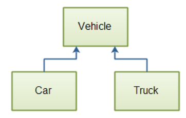

# Herança em Java

A *herança em Java* refere-se à capacidade em Java de uma classe herdar de outra classe. Isso também é chamado de estender (*extending*) uma classe. Uma classe pode *estender* outra classe e, com isso, *herdar* dessa classe.

Quando uma classe herda de outra classe em Java, as duas classes assumem certos papéis. A classe que estende (herda de outra classe) é a *subclasse* e a classe que está sendo estendida (a classe da qual se está herdando) é a *superclasse*. Em outras palavras, a subclasse estende a superclasse. Ou, a subclasse herda da superclasse.

Outro termo comumente usado para herança é *especialização* e *generalização*. Uma subclasse é uma especialização de uma superclasse, e uma superclasse é uma generalização de uma ou mais subclasses.

## A herança é um método de reutilização de código

A herança pode ser um método eficaz para compartilhar código entre classes que têm algumas características em comum, permitindo que as classes tenham algumas partes que sejam diferentes.

Aqui está um diagrama ilustrando uma classe chamada `Vehicle`, que possui duas subclasses chamadas `Car` e `Truck`.

<p align="center">
  
  <p align="center">As classes <i>Car</i> e <i>Truck</i> herdam da classe <i>Vehicle</i></p>
</p>

A classe `Vehicle` é a superclasse de `Car` e `Truck`. `Car` e `Truck` são subclasses de `Vehicle`. A classe `Vehicle` pode conter os campos e métodos que todos os `Vehicle` precisam (por exemplo, uma placa de licença, proprietário, etc.), enquanto `Car` e `Truck` podem conter os campos e métodos que são específicos para `Car` e `Truck`.

## Hierarquias de Classes

Superclasses e subclasses formam uma estrutura de herança que também é chamada de *hierarquia de classes*. No topo da hierarquia de classes você tem as superclasses. Na parte inferior da hierarquia de classes você tem as subclasses.

Uma hierarquia de classes pode ter múltiplos níveis, o que significa múltiplos níveis de superclasses e subclasses. A subclasse pode, por si mesma, ser uma superclasse de outras subclasses, etc.

## Fundamentos da Herança em Java

Quando uma classe herda de uma superclasse, ela herda partes dos métodos e campos da superclasse. A subclasse também pode sobrescrever (redefinir) os métodos herdados. Os campos não podem ser sobrescritos, mas podem ser "ocultados" (*shadowed*) nas subclasses. Como tudo isso funciona é abordado mais adiante neste texto.

### O que é Herdado?

Quando uma subclasse estende uma superclasse em Java, todos os campos e métodos `protected` e `public` da superclasse são herdados pela subclasse. Por *herdado*, entende-se que esses campos e métodos fazem parte da subclasse, como se a própria subclasse os tivesse declarado. Campos `protected` e `public` podem ser chamados e referenciados exatamente como os métodos declarados diretamente na subclasse.

Campos e métodos com modificadores de acesso padrão (*default* / pacote) só podem ser acessados por subclasses se a subclasse estiver localizada no mesmo pacote que a superclasse. Campos e métodos privados (`private`) da superclasse nunca podem ser referenciados diretamente por subclasses. Eles podem, contudo, ser referenciados indiretamente por meio de métodos acessíveis a partir da subclasse (por exemplo, métodos padrão (pacote), `protected` e `public`).

Os construtores não são herdados pelas subclasses, mas um construtor de subclasse deve chamar um construtor na superclasse. Isso será explicado em detalhes em uma seção posterior.

### Java Suporta Apenas Herança Simples

O mecanismo de herança do Java permite apenas que uma classe Java herde de uma única superclasse (herança simples / *singular inheritance*). Em algumas linguagens de programação, como C++, é possível que uma subclasse herde de múltiplas superclasses (herança múltipla). Como a herança múltipla pode criar alguns problemas estranhos, se, por exemplo, as superclasses contiverem métodos com os mesmos nomes e parâmetros, a herança múltipla foi deixada de fora no Java.

## Declarando Herança em Java

Em Java, a herança é declarada usando a palavra-chave `extends`. Você declara que uma classe estende outra classe usando a palavra-chave `extends` na definição da classe. Aqui está um exemplo de herança em Java usando a palavra-chave `extends`:

```java
public class Vehicle {
    protected String licensePlate = null;

    public void setLicensePlate(String license) {
        this.licensePlate = license;
    }
}

```

```java
public class Car extends Vehicle {
    int numberOfSeats = 0;

    public String getNumberOfSeats() {
        return this.numberOfSeats;
    }
}

```

A classe `Car` neste exemplo estende a classe `Vehicle`, significando que a classe `Car` herda da classe `Vehicle`.

Como a classe `Car` estende a classe `Vehicle`, o campo `protected` `licensePlate` da classe `Vehicle` é herdado pela classe `Car`. Quando o campo `licensePlate` é herdado, ele fica acessível dentro de uma instância de `Car`.

O campo `licensePlate` não está sendo realmente referenciado a partir da classe `Car` no código acima, mas poderia se quiséssemos. Aqui está um exemplo que mostra como isso poderia ser:

```java
public class Car extends Vehicle {
    int numberOfSeats = 0;

    public String getNumberOfSeats() {
        return this.numberOfSeats;
    }

    public String getLicensePlate() {
        return this.licensePlate;
    }
}

```

A referenciação acontece dentro do método `getLicensePlate()`.

Em muitos casos, faria sentido colocar o método `getLicensePlate()` na classe `Vehicle` onde o campo `licensePlate` está localizado. Eu apenas coloquei o método `getLicensePlate()` na classe `Car` para mostrar que é possível.

## Herança e Conversão de Tipo (Type Casting)

É possível referenciar uma subclasse como uma instância de uma de suas superclasses. Por exemplo, usando as definições de classe do exemplo da seção anterior, é possível referenciar uma instância da classe `Car` como uma instância da classe `Vehicle`. Como a classe `Car` estende (herda de) a classe `Vehicle`, diz-se também que ela **é um** `Vehicle`.

Aqui está um exemplo de código Java:

```java
Car     car     = new Car();
Vehicle vehicle = car;

```

Primeiro, uma instância de `Car` é criada. Segundo, a instância de `Car` é atribuída a uma variável do tipo `Vehicle`. Agora a variável (referência) `Vehicle` aponta para a instância de `Car`. Isso é possível porque a classe `Car` herda da classe `Vehicle`.

Como você pode ver, é possível usar uma instância de alguma subclasse como se fosse uma instância de sua superclasse. Dessa forma, você não precisa saber exatamente de qual subclasse o objeto é uma instância. Você poderia tratar, por exemplo, tanto instâncias de `Truck` quanto de `Car` como instâncias de `Vehicle`.

O processo de referenciar um objeto de uma classe como um tipo diferente da própria classe é chamado de conversão de tipo (*type casting*). Você converte um objeto de um tipo para outro.

### Upcasting e Downcasting

Você sempre pode converter um objeto de uma subclasse para uma de suas superclasses. Isso é conhecido como *upcasting* (de um tipo de subclasse para um tipo de superclasse).

Também pode ser possível converter um objeto de um tipo de superclasse para um tipo de subclasse, mas apenas se o objeto for realmente uma instância dessa subclasse (ou uma instância de uma subclasse dessa subclasse). Isso é conhecido como *downcasting* (de um tipo de superclasse para um tipo de subclasse). Portanto, este exemplo de *downcasting* é válido:

```java
Car     car     = new Car();

// upcast to Vehicle
Vehicle vehicle = car;

// downcast to car again
Car     car2    =  (Car) vehicle;

```

No entanto, o exemplo de *downcasting* a seguir não é válido. O compilador Java irá aceitá-lo, mas em tempo de execução, quando esse código for executado, o código lançará uma `ClassCastException`.

```java
Truck   truck   = new Truck();

// upcast to Vehicle
Vehicle vehicle = truck;

// downcast to car again
Car     car     =  (Car) vehicle;

```

O objeto `Truck` pode ser convertido via *upcast* para um objeto `Vehicle`, mas não pode ser convertido via *downcast* para um objeto `Car` mais tarde. Isso resultará em uma `ClassCastException`.

## Sobrescrita de Métodos (Overriding Methods)

Em uma subclasse, você pode sobrescrever (redefinir) métodos definidos na superclasse. Aqui está um exemplo de sobrescrita de método em Java:

```java
public class Vehicle {

    String licensePlate = null;

    public void setLicensePlate(String licensePlate) {
        this.licensePlate = licensePlate;
    }
}

```

```java
public class Car extends Vehicle {

    public void setLicensePlate(String license) {
        this.licensePlate = license.toLowerCase();
    }

}

```

Observe como tanto a classe `Vehicle` quanto a classe `Car` definem um método chamado `setLicensePlate()`. Agora, sempre que o método `setLicensePlate()` for chamado em um objeto `Car`, é o método definido na classe `Car` que será chamado. O método na superclasse é ignorado.

Para sobrescrever um método, a assinatura do método na subclasse deve ser a mesma que na superclasse. Isso significa que a definição do método na subclasse deve ter exatamente o mesmo nome e o mesmo número e tipo de parâmetros, e os parâmetros devem ser listados exatamente na mesma sequência que na superclasse. Caso contrário, o método na subclasse será considerado um método separado.

Em Java, você não pode sobrescrever métodos privados (`private`) de uma superclasse. Se a superclasse chamar um método privado internamente a partir de algum outro método, ela continuará chamando esse método da superclasse, mesmo que você crie um método privado na subclasse com a mesma assinatura.

### A Anotação @Override

Se você sobrescrever um método em uma subclasse e o método for de repente removido, renomeado ou tiver sua assinatura alterada na superclasse, o método na subclasse não estará mais sobrescrevendo o método na superclasse. Mas como você sabe disso? Seria bom se o compilador pudesse lhe dizer que o método que está sendo sobrescrito não sobrescreve mais um método na superclasse, certo?

É para isso que serve a anotação `@Override` do Java. Você coloca a anotação `@Override` do Java acima do método que sobrescreve um método em uma superclasse. Aqui está um exemplo de `@Override` em Java:

```java
public class Car extends Vehicle {

    @Override
    public void setLicensePlate(String license) {
        this.licensePlate = license.toLowerCase();
    }
}

```

### Chamando Métodos da Superclasse

Se você sobrescrever um método em uma subclasse, mas ainda assim precisar chamar o método definido na superclasse, você pode fazer isso usando a referência `super`, assim:

```java
public class Car extends Vehicle {

    public void setLicensePlate(String license) {
        super.setLicensePlate(license);
    }
}

```

No exemplo de código acima, o método `setLicensePlate()` na classe `Car` chama o método `setLicensePlate()` na classe `Vehicle`.

Você pode chamar implementações da superclasse a partir de qualquer método em uma subclasse, como mostrado acima. Não precisa ser a partir do próprio método sobrescrito. Por exemplo, você também poderia ter chamado `super.setLicensePlate()` a partir de um método na classe `Car` chamado `updateLicensePlate()`, que não sobrescreve o método `setLicensePlate()`.

## A Instrução instanceof

O Java contém uma instrução chamada `instanceof`. A instrução `instanceof` pode determinar se um determinado objeto é uma instância de alguma classe. Aqui está um exemplo de `instanceof` em Java:

```java
Car car = new Car();
boolean isCar = car instanceof Car;

```

Depois que esse código for executado, a variável `isCar` conterá o valor `true`.

A instrução `instanceof` também pode ser usada para determinar se um objeto é uma instância de uma superclasse de sua classe. Aqui está um exemplo de `instanceof` que verifica se um objeto `Car` é uma instância de `Vehicle`:

```java
Car car = new Car();
boolean isVehicle = car instanceof Vehicle;

```

Assumindo que a classe `Car` estende (herda de) a classe `Vehicle`, a variável `isVehicle` conterá o valor `true` após a execução desse código. Um objeto `Car` também é um objeto `Vehicle` porque `Car` é uma subclasse de `Vehicle`.

Como você pode ver, a instrução `instanceof` pode ser usada para explorar a hierarquia de herança.

O tipo de variável usado com a instrução `instanceof` não afeta o seu resultado. Veja este exemplo de `instanceof`:

```java
Car car = new Car();
Vehicle vehicle = car;
boolean isCar = vehicle instanceof Car;

```

Embora a variável `vehicle` seja do tipo `Vehicle`, o objeto para o qual ela acaba apontando neste exemplo é um objeto `Car`. Portanto, a instrução `vehicle instanceof Car` resultará em `true`.

Aqui está o mesmo exemplo de `instanceof`, mas usando um objeto `Truck` em vez de um objeto `Car`:

```java
Truck truck = new Truck();
Vehicle vehicle = truck;
boolean isCar = vehicle instanceof Car;

```

Após a execução desse código, a variável `isCar` conterá o valor `false`. O objeto `Truck` não é um objeto `Car`.

## Campos e Herança

Como mencionado anteriormente, em Java os campos não podem ser sobrescritos em uma subclasse. Se você definir um campo em uma subclasse com o mesmo nome de um campo na superclasse, o campo na subclasse irá ocultar (*shadow*) o campo na superclasse. Se a subclasse tentar acessar o campo, ela acessará o campo na subclasse.

Se, no entanto, a subclasse fizer uma chamada para um método na superclasse, e esse método acessar o campo com o mesmo nome que na subclasse, será o campo na superclasse que será acessado.

Aqui está um exemplo de herança em Java que ilustra como campos em subclasses ocultam (sombreiam) campos em superclasses:

```java
public class Vehicle {

    String licensePlate = null;

    public void setLicensePlate(String licensePlate) {
        this.licensePlate = licensePlate;
    }

    public String getLicensePlate() {
        return licensePlate;
    }
}

```

```java
public class Car extends Vehicle {

    protected String licensePlate = null;

    @Override
    public void setLicensePlate(String license) {
        super.setLicensePlate(license);
    }

    @Override
    public String getLicensePlate() {
        return super.getLicensePlate();
    }

    public void updateLicensePlate(String license){
        this.licensePlate = license;
    }
}

```

Observe como ambas as classes têm um campo `licensePlate` definido.

Tanto a classe `Vehicle` quant a classe `Car` possuem os métodos `setLicensePlate()` e `getLicensePlate()`. Os métodos na classe `Car` chamam os métodos correspondentes na classe `Vehicle`. O resultado é que, eventualmente, ambos os conjuntos de métodos acessam o campo `licensePlate` na classe `Vehicle`.

O método `updateLicensePlate()` na classe `Car`, porém, acessa o campo `licensePlate` diretamente. Assim, ele acessa o campo `licensePlate` da classe `Car`. Portanto, você não obterá o mesmo resultado ao chamar `setLicensePlate()` que obteria ao chamar o método `updateLicense()`.

Veja as seguintes linhas de código Java:

```java
Car car = new Car();

car.setLicensePlate("123");
car.updateLicensePlate("abc");

System.out.println("license plate: " + car.getLicensePlate());

```

Este código Java imprimirá o texto `123`.

O método `updateLicensePlate()` define o valor da placa de licença no campo `licensePlate` na classe `Car`. O método `getLicensePlate()`, no entanto, retorna o valor do campo `licensePlate` na classe `Vehicle`. Portanto, o valor `123`, que é definido como o valor para o campo `licensePlate` na classe `Vehicle` por meio do método `setLicensePlate()`, é o que é impresso.

## Construtores e Herança

O mecanismo de herança do Java não inclui construtores. Em outras palavras, os construtores de uma superclasse não são herdados pelas subclasses. As subclasses ainda podem chamar os construtores na superclasse usando a estrutura `super()`. De fato, exige-se que um construtor de subclasse chame um dos construtores na superclasse como a primeiríssima ação dentro do corpo do construtor. Veja como isso se parece:

```java
public class Vehicle {
    public Vehicle() {
    }
}

```

```java
public class Car extends Vehicle{
    public Car() {
        super();
        //perform other initialization here
    }
}

```

Observe a chamada para `super()` dentro do construtor de `Car`. Essa chamada `super()` executa o construtor na classe `Vehicle`.

Você deve ter visto classes Java onde os construtores das subclasses não pareciam chamar os construtores na superclasse. Talvez a superclasse nem sequer tivesse um construtor. No entanto, os construtores das subclasses ainda assim chamaram os construtores da superclasse nesses casos. Você apenas não conseguia ver. Deixe-me explicar o porquê:

Se uma classe não tiver nenhum construtor explícito definido, o compilador Java insere um construtor sem argumentos (*no-arg constructor*) implícito. Portanto, uma classe sempre possui um construtor. Sendo assim, a seguinte versão de `Vehicle` é equivalente à versão mostrada logo acima:

```java
public class Vehicle {
}

```

Segundo, se um construtor não chama explicitamente um construtor na superclasse, o compilador Java insere uma chamada implícita ao construtor sem argumentos na superclasse. Isso significa que a seguinte versão da classe `Car` é, na verdade, equivalente à versão mostrada anteriormente:

```java
public class Car extends Vehicle{
    public Car() {
    }
}

```

De fato, como o construtor agora está vazio, poderíamos deixá-lo de fora e o compilador Java o inseriria, além de inserir uma chamada implícita ao construtor sem argumentos na superclasse. É assim que as duas classes se pareceriam então:

```java
public class Vehicle {
}

```

```java
public class Car extends Vehicle{
}

```

Embora nenhum construtor seja declarado nessas duas classes, ambas recebem um construtor sem argumentos, e o construtor sem argumentos na classe `Car` chamará o construtor sem argumentos na classe `Vehicle`.

Se a classe `Vehicle` não tivesse um construtor sem argumentos, mas tivesse outro construtor que aceitasse parâmetros, o compilador Java iria reclamar. A classe `Car` seria então obrigada a declarar um construtor e, dentro desse construtor, chamar o construtor da classe `Vehicle`.

## Classes Aninhadas (Nested Classes) e Herança

As mesmas regras de herança do Java se aplicam a classes aninhadas (*nested classes*). Classes aninhadas declaradas como `private` não são herdadas. Classes aninhadas com o modificador de acesso padrão (pacote) só são acessíveis às subclasses se a subclasse estiver localizada no mesmo pacote que a superclasse. Classes aninhadas com o modificador de acesso `protected` ou `public` são sempre herdadas pelas subclasses.

Aqui está um exemplo de herança de classe aninhada:

```java
class MyClass {

    class MyNestedClass {
    }
}

```

```java
public class MySubclass extends MyClass {

    public static void main(String[] args) {
        MySubclass subclass = new MySubclass();
        MyNestedClass nested = subclass.new MyNestedClass();
    }
}

```

Observe como é possível criar uma instância da classe aninhada `MyNestedClass`, que está definida na superclasse (`MyClass`), por meio de uma referência à subclasse (`MySubclass`).

## Classes Finais (Final Classes) e Herança

Uma classe pode ser declarada como `final`. Veja como isso se parece:

```java
public final class MyClass {
}

```

Uma classe `final` não pode ser estendida. Em outras palavras, você não pode herdar de uma classe `final` em Java.

## Classes Abstratas e Herança

Em Java, uma classe pode ser declarada como `abstract`. Euifiquei as classes abstratas em mais detalhes no meu tutorial de classes abstratas em Java.

Uma classe abstrata é uma classe que não contém a implementação completa do que quer que a classe abstrata devesse fazer. Sendo assim, ela não pode ser instanciada. Em outras palavras, você não pode criar objetos de uma classe abstrata.

Em Java, las classes abstratas têm o propósito de ser estendidas para criar uma implementação completa. Portanto, é totalmente possível estender uma classe abstrata. As regras de herança do Java são as mesmas tanto para classes abstratas quanto para classes não abstratas.
