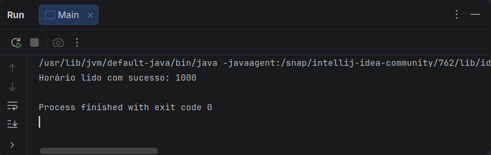
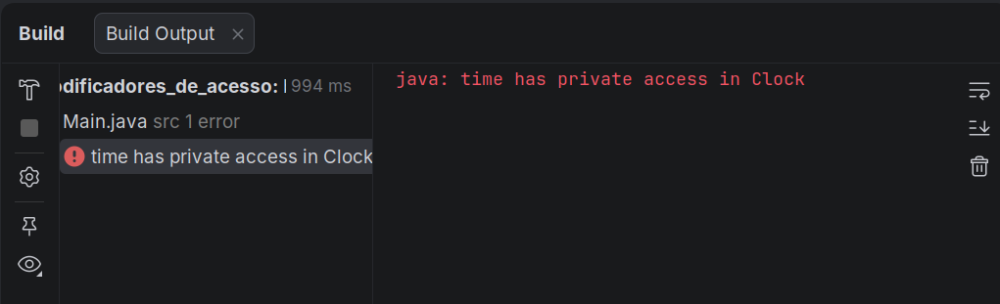
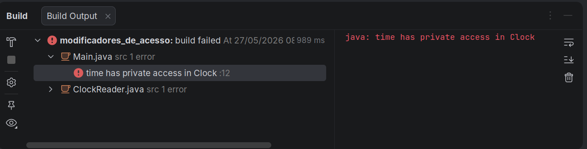
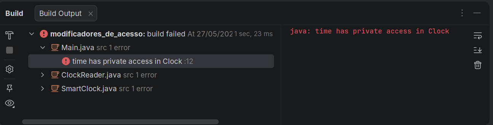
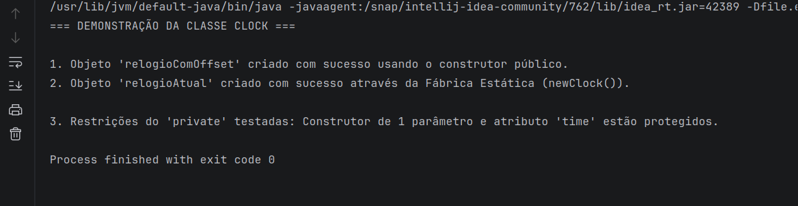

# Modificadores de Acesso em Java

Um modificador de acesso em Java especifica quais classes podem acessar uma determinada classe e seus campos, construtores e métodos. Eles são às vezes chamados informalmente de especificadores de acesso, mas o nome correto é **modificadores de acesso**.

Classes, campos, construtores e métodos podem ter um dos quatro modificadores de acesso:

- **private**
- **default (package)**
- **protected**
- **public**

A tabela a seguir resume em quais construções cada modificador pode ser aplicado:

|               | private | default | protected | public |
|---------------|---------|---------|-----------|--------|
| Classe        | ❌     | ✅     | ❌       | ✅    |
| Classe Interna| ✅     | ✅     | ✅       | ✅    |
| Construtor    | ✅     | ✅     | ✅       | ✅    |
| Método        | ✅     | ✅     | ✅       | ✅    |
| Campo         | ✅     | ✅     | ✅       | ✅    |

Atribuir um modificador de acesso a uma classe, construtor, campo ou método também é chamado de “marcar” esse elemento como público, privado, etc.

---

## Modificador **private**

Se um método ou variável for marcado como **private**, apenas o código dentro da mesma classe pode acessá-lo. Subclasses ou classes externas não têm acesso. Classes não podem ser marcadas como privadas.

Exemplo:

```java
public class Clock {
    private long time = 0;
}
```

O campo `time` não pode ser acessado fora da classe `Clock`.

### Exemplos práticos:

Aqui estão os exemplos práticos de onde a variável `private` **pode** e **não pode** ser acessada, seguindo a mesma estrutura:</br>

O modificador `private` restringe o acesso exclusivamente ao escopo da própria classe onde a variável foi declarada.

```java
/**
 * A classe Clock demonstra o conceito de ocultamento de dados (Data Hiding).
 */
public class Clock {

    // O modificador 'private' restringe o acesso diretamente a esta classe.
    // Nenhuma classe externa (nem mesmo a Main) pode ler ou alterar 
    // 'time' diretamente, protegendo o estado interno do objeto.
    // O valor 1000 aqui representa 10:00 em um formato simplificado (HHmm).
    private long time = 1000;

    /**
     * Este é um método 'getter'. Ele é public, o que significa que 
     * serve como a interface oficial para o mundo exterior.
     *
     * FUNCIONA: O método 'readClock' está DENTRO da classe Clock,
     * então ele tem permissão total para acessar a variável 'private time'.
     */
    public long readClock() {
        // O uso do 'this' referencia o atributo da própria instância.
        return this.time;
    }
}
```

Classe Main:

```java
1:  public class Main {
2:      public static void main(String[] args) {
3:          // 1. Criando uma instância (objeto) da classe Clock
4:          Clock meuRelogio = new Clock();
5:  
6:          // 2. FORMA CORRETA: Acessando o valor através do método público
7:          // Como 'readClock()' é público, qualquer classe pode chamá-lo.
8:          long valorDoRelogio = meuRelogio.readClock();
9:          System.out.println("Horário lido com sucesso: " + valorDoRelogio);
10: 
11:         // 3. FORMA INCORRETA (Se desproteger a linha abaixo, o código não compila):
12:         // System.out.println(meuRelogio.time);
13:         // Erro: time has private access in Clock
14:     }
15: }
```

Saída (linha 12 comentada) :

<p align="center">
  
</p>

Saída (linha 12 descomentada) :

<p align="center">
  
</p>

### Exemplos adicionais onde a variável `private` NÃO PODE ser acessada (Classes externas ou Subclasses)

Nenhuma outra classe no universo do seu código — mesmo que seja uma herança (subclasse) ou que esteja no mesmo pacote — conseguirá acessar nessa variável diretamente.

#### Cenário 1: Uma classe externa tentando acessar

```java
public class ClockReader {
    void exibir() {
        Clock clock = new Clock();
        // ERRO DE COMPILAÇÃO: 'time' tem acesso privado em 'Clock'.
        // Você não pode acessá-lo diretamente a partir de outra classe.
        System.out.println(clock.time); 
    }
}
```

Saída:

<p align="center">
  
</p>

#### Cenário 2: Uma subclasse (Herança) tentando acessar

```java
// SmartClock herda tudo de Clock, mas...
public class SmartClock extends Clock {
    void resetar() {
        // ERRO DE COMPILAÇÃO: Mesmo sendo uma "filha" da classe Clock,
        // o atributo 'time' é privado da mãe e não é herdado diretamente.
        this.time = 0; 
    }
}

```

Saída: 

<p align="center">
  
</p>

---

### Acessando campos privados via métodos acessores (**getters** e **setters**)

Campos privados geralmente são acessados por meio de métodos **getters** e **setters** (no primeiro exemplo, a classe `Clock` já implementava esse princípio através do método `readClock` **DENTRO** da classe Clock). 

Segue um exemplo:

```java
public class Clock {
    // Atributo privado: impede o acesso direto ou modificações maliciosas/acidentais de fora da classe
    private long time = 0;

    // Método Getter: permite que o mundo exterior consulte o valor de 'time' de forma segura e controlada
    public long getTime() {
        // Retorna o valor armazenado no atributo 'time' da instância atual (this)
        return this.time;
    }

    // Método Setter: permite que o mundo exterior altere o valor de 'time' seguindo as regras da classe
    public void setTime(long theTime) {
        // Atribui o valor recebido no parâmetro 'theTime' ao atributo privado 'this.time'
        this.time = theTime;
    }
}
```

### Construtores privados

Um construtor privado não pode ser chamado fora da classe, mas pode ser usado dentro dela.

#### Classe Clock

```java
public class Clock {
    // Atributo privado: guarda o estado interno do tempo do relógio
    private long time = 0;

    // Construtor Privado: SÓ pode ser invocado por membros de dentro desta mesma classe
    private Clock(long time) {
        // Inicializa o atributo 'time' com o valor recebido no parâmetro
        this.time = time;
    }

    // Construtor Público: Pode ser chamado por qualquer classe externa (ex: new Clock(1000, 50))
    public Clock(long time, long timeOffset) {
        // USO DO CONSTRUTOR PRIVADO: O 'this(time)' chama o construtor privado acima para inicializar a variável
        this(time);
        // Aplica o deslocamento (offset) somando o valor ao atributo 'time' já inicializado
        this.time += timeOffset;
    }

    // Método Fábrica Estático (Static Factory Method): É público e acessível de fora da classe
    public static Clock newClock() {
        // USO DO CONSTRUTOR PRIVADO: Como este método está DENTRO da classe, ele pode dar 'new' usando o construtor privado
        return new Clock(System.currentTimeMillis());
    }
}
```

O `this(time)` faz o que chamamos em Java de **encadeamento de construtores** (*constructor chaining*). Em termos simples: ele é uma instrução que diz ao Java para **chamar outro construtor da mesma classe** antes de executar o resto do código do construtor atual.

Aqui está o passo a passo de como ele funciona no seu exemplo:

#### O Fluxo de Execução

Quando alguém executa `new Clock(1000, 50);`, o Java faz o seguinte caminho:

1. Ele entra no **segundo construtor** (o público, que recebe dois parâmetros).
2. A primeira linha que ele encontra é `this(time);` (onde `time` vale `1000`).
3. O Java temporariamente "pausa" esse construtor e pula direto para o **primeiro construtor** (o privado), que aceita apenas um parâmetro do tipo `long`.
4. O construtor privado roda e executa `this.time = time;` (guardando o valor `1000` no atributo da classe).
5. Assim que o construtor privado termina, o Java **volta** para o construtor público, exatamente na linha logo abaixo do `this(time);`.
6. Ele continua a execução e roda `this.time += timeOffset;` (somando mais `50` ao valor, totalizando `1050`).

#### Duas regras de ouro do `this(...)` como construtor:

* **Deve ser a primeira linha:** O Java exige estritamente que a chamada `this(...)` seja a **primeira instrução** dentro do construtor. Se você tentar colocar qualquer linha de código antes dele, o compilador vai gerar um erro.
* **Evita duplicação:** A principal utilidade disso é não precisar repetir o código de inicialização básica (como `this.time = time;`) em todos os construtores que você criar. Você centraliza a lógica em um construtor principal e faz os outros "reaproveitarem" ele.

#### Classe Main (exemplo de implementação)

```java
public class Main {
    public static void main(String[] args) {
        
        System.out.println("=== DEMONSTRAÇÃO DA CLASSE CLOCK ===\n");

        // ------------------------------------------------------------------------
        // USO 1: O Construtor Público (com dois parâmetros)
        // ------------------------------------------------------------------------
        // Criando um relógio que começa às 10:00 (1000) e adicionando um offset de 15 minutos
        Clock relogioComOffset = new Clock(1000, 15);
        
        // Nota: Como a classe Clock não possui um método "getTime" ou "readClock" neste momento,
        // não conseguimos printar o valor interno no console sem alterar a classe Clock.
        // Mas o objeto foi criado com sucesso utilizando o encadeamento de construtores!
        System.out.println("1. Objeto 'relogioComOffset' criado com sucesso usando o construtor público.");


        // ------------------------------------------------------------------------
        // USO 2: O Método Fábrica Estático (A "Fábrica" - IMPORTANTE)
        // ------------------------------------------------------------------------
        // Veja que NÃO usamos a palavra 'new'. Chamamos a fábrica direto pela Classe.
        // Esse método vai rodar lá dentro, capturar o System.currentTimeMillis() e nos devolver o objeto pronto.
        Clock relogioAtual = Clock.newClock();
        
        System.out.println("2. Objeto 'relogioAtual' criado com sucesso através da Fábrica Estática (newClock()).");


        // ------------------------------------------------------------------------
        // O QUE NÃO FUNCIONA? (Restrições do modificador Private)
        // ------------------------------------------------------------------------
        
        // CENÁRIO A: Tentar usar o construtor de 1 parâmetro de fora da classe
        // Clock relogioErro = new Clock(1000); 
        // Erro de compilação: Clock(long) has private access in Clock

        // CENÁRIO B: Tentar acessar o atributo diretamente
        // relogioAtual.time = 2000; 
        // Erro de compilação: time has private access in Clock
        
        System.out.println("\n3. Restrições do 'private' testadas: Construtor de 1 parâmetro e atributo 'time' estão protegidos.");
    }
}
```

Saída:

<p align="center">
  
</p>

Diferença entre **Instanciação Direta** (Construtor) e **Método Fábrica** (Static Factory Method)

A diferença principal está em quem define as regras de criação do objeto e como a memória do Java é acionada.

#### 1️⃣ new Clock(1000, 15); <-- Instanciação Direta via Construtor

- **O que faz**: Você está chamando diretamente um construtor público da classe usando a palavra-chave new.
- **Como funciona**: Você (quem está escrevendo a classe Main) tem o controle total e a obrigação de passar os parâmetros manuais exigidos (1000 e 15).
- **Metáfora**: É como comprar um móvel planejado onde você precisa passar as medidas exatas para a fábrica começar a cortar a madeira.

#### 2️⃣ Clock.newClock(); <-- Chamada via Método Fábrica)

- **O que faz**: Você está chamando um método estático que atua como uma "fábrica oculta".
- **Como funciona**: Você não usa a palavra new diretamente. A classe Clock resolve toda a criação internamente de forma automatizada (ela mesma busca a hora atual do sistema e invoca o seu próprio construtor privado). Você apenas recebe o objeto pronto.
- **Metáfora**: É como ir a uma lanchonete e pedir o "Combo do Dia". Você não precisa dizer ao cozinheiro a quantidade de gramas de carne ou o tempo de chapa; o atendente apenas te entrega o pedido pronto.

#### No primeiro caso, você dita os dados de inicialização. No segundo caso, a própria classe decide os dados (a hora atual) através de um processo encapsulado e mais limpo.

---

## Modificador **default (package)**

O modificador **default** é aplicado quando nenhum modificador é escrito. Ele permite acesso dentro da mesma classe e dentro de classes do mesmo pacote. Por isso, também é chamado de **package access modifier**.

Exemplo:

```java
// Primeira classe do arquivo. 
// Nota: Em Java, você só pode ter uma classe 'public' por arquivo .java, 
// e o nome do arquivo deve ser exatamente o nome dessa classe (Clock.java).
public class Clock {
    // Atributo do tipo long inicializado em 0.
    // Como nenhum modificador (public, private, protected) foi especificado,
    // ele usa o modificador "default" (também conhecido como package-private).
    // Isso significa que apenas classes dentro do MESMO pacote podem acessá-lo diretamente.
    long time = 0; 
}

// Segunda classe. Para que o código compile no mesmo arquivo, 
// esta classe não pode ser declarada como 'public'.
class ClockReader {
    // Instancia um novo objeto da classe Clock.
    // Isso é permitido desde que ClockReader esteja no mesmo pacote que Clock,
    // ou que Clock seja public (como é o caso).
    Clock clock = new Clock();

    // Método público que retorna o valor do tempo.
    public long readClock() {
        // Acessa diretamente o atributo 'time' do objeto 'clock'.
        // Isso só funciona porque ClockReader está no mesmo pacote que Clock,
        // respeitando o modificador "default" da variável 'time'.
        return clock.time;
    }
}
```

Como não há nenhum modificador explícito (`private`, `protected` ou `public`), o Java aplica automaticamente o modificador **default**. Isso significa que o campo `time` pode ser acessado por qualquer classe que esteja no **mesmo pacote** da classe `Clock`, como a classe `ClockReader` no exemplo.  

Portanto, o acesso `clock.time` dentro de `ClockReader` funciona porque ambas as classes estão no mesmo pacote e o campo `time` foi declarado com acesso **default**.

---

## Modificador **protected**

O modificador **protected** funciona como o **default**, mas também permite que subclasses acessem métodos e campos da superclasse, mesmo que estejam em pacotes diferentes.

Exemplo:

```java
public class Clock {
    protected long time = 0; // tempo em milissegundos
}

public class SmartClock extends Clock {
    public long getTimeInSeconds() {
        return this.time / 1000;
    }
}
```

No exemplo do **modificador protected**, o campo `time` da classe `Clock` foi declarado como:

```java
protected long time = 0; // tempo em milissegundos
```

Isso significa que:

- Assim como no **default**, o campo pode ser acessado por qualquer classe dentro do mesmo pacote.  
- A diferença é que, com **protected**, **subclasses** também podem acessar esse campo, mesmo que estejam em pacotes diferentes.  

Na prática, a classe `SmartClock`, que **herda** de `Clock`, consegue acessar diretamente o campo `time` porque ele está marcado como **protected**:

```java
public class SmartClock extends Clock {
    public long getTimeInSeconds() {
        return this.time / 1000; // acesso permitido por ser protected
    }
}
```

Se `time` fosse apenas **default**, `SmartClock` só teria acesso se estivesse no mesmo pacote. Como está marcado como **protected**, o acesso é garantido pela relação de herança, independentemente do pacote.  

👉 Em resumo: o modificador **protected** amplia o alcance do **default**, permitindo acesso também por subclasses fora do pacote.

---

## Modificador **public**

O modificador **public** permite acesso de qualquer código, em qualquer classe ou pacote.

Exemplo:

```java
public class Clock {
    public long time = 0;
}

public class ClockReader {
    Clock clock = new Clock();

    public long readClock() {
        return clock.time;
    }
}
```

---

## Modificadores de Classe

O modificador de acesso aplicado a uma classe tem precedência sobre os modificadores de seus membros. Classes só podem ser **default** ou **public**. Não podem ser **private** ou **protected**.

---

## Modificadores de Interface

Interfaces em Java definem métodos e campos que devem ser públicos. Portanto, não é permitido usar **private**, **protected** ou mesmo o **default**. Todos os membros de uma interface são implicitamente **public**.

---

## Modificadores e Herança

Ao sobrescrever métodos em subclasses, não é permitido reduzir o nível de acesso.  
- Se um método na superclasse é **public**, ele deve continuar sendo **public** na subclasse.  
- Se for **protected**, pode ser **protected** ou **public** na subclasse.  
- É permitido aumentar o nível de acesso (por exemplo, de **default** para **public**).
