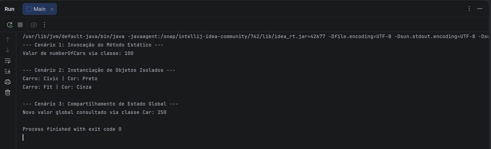

# Um Guia para a Palavra-chave Static em Java

## 1. Visão Geral
Neste tutorial, exploraremos em detalhes a palavra-chave **static** da linguagem Java. A palavra-chave *static* significa que um membro – como um campo ou método – pertence à classe em si, em vez de a qualquer instância específica dessa classe. Como resultado, podemos acessar membros estáticos sem a necessidade de criar uma instância de um objeto.  

Começaremos discutindo as diferenças entre campos e métodos estáticos e não estáticos. Em seguida, cobriremos classes e blocos de código estáticos e explicaremos por que componentes não estáticos não podem ser acessados a partir de um contexto estático.

---

## 2. Os Campos static (Ou Variáveis de Classe)
Em Java, quando declaramos um campo como *static*, exatamente uma única cópia desse campo é criada e compartilhada entre todas as instâncias dessa classe. Não importa quantas vezes instanciamos uma classe: sempre haverá apenas uma cópia do campo estático pertencente a ela.  

O valor desse campo estático é compartilhado entre todos os objetos da mesma classe.  

Imagine uma classe com várias variáveis de instância, onde cada novo objeto criado dessa classe tem sua própria cópia dessas variáveis. No entanto, se quisermos que uma variável rastreie o número de objetos criados, usamos uma variável estática. Isso permite que o contador seja incrementado a cada novo objeto:

```java
public class Car {
    private String name;
    private String engine;
    public static int numberOfCars;

    public Car(String name, String engine) {
        this.name = name;
        this.engine = engine;
        numberOfCars++;
    }
    // getters e setters
}
```

Como resultado, a variável estática `numberOfCars` será incrementada cada vez que instanciarmos a classe `Car`.  

```java
@Test
public void whenNumberOfCarObjectsInitialized_thenStaticCounterIncreases() {
    new Car("Jaguar", "V8");
    new Car("Bugatti", "W16");
    assertEquals(2, Car.numberOfCars);
}
```

Campos estáticos são úteis quando:

- O valor da variável é independente dos objetos.
- O valor deve ser compartilhado entre todos os objetos.

Por fim, é importante saber que campos estáticos podem ser acessados por meio de uma instância (`ford.numberOfCars++`) ou diretamente pela classe (`Car.numberOfCars++`). A segunda forma é preferida, pois indica claramente que se trata de uma variável de classe.

---

## 3. Os Métodos static (Ou Métodos de Classe)

Assim como os campos estáticos, métodos estáticos também pertencem a uma classe em vez de a um objeto. Portanto, podemos invocá-los **sem instanciar a classe**.  

Geralmente, usamos métodos estáticos para realizar operações que não dependem da criação de instâncias. Por exemplo, podemos usar um método estático para compartilhar código entre todas as instâncias da classe:

```java
static void setNumberOfCars(int numberOfCars) {
    Car.numberOfCars = numberOfCars;
}
```

### Detalhamento (aprofundando)

Um exemplo foi estruturado para demonstrar como métodos e variáveis estáticas interagem com o sistema de memória do Java. Abaixo, o código COMPLETO dividido entre a classe de definição (`Car`) e a classe de execução (`Main`).

#### 1. A Classe Principal (Car.java)

Esta classe define a estrutura do objeto e contém o membro estático que gerencia o estado global da frota.

```java
public class Car {
    // 1. ATRIBUTO ESTÁTICO (Variável de Classe)
    // Alocado na área de memória estática (Metaspace). Existe apenas uma cópia para toda a classe.
    public static int numberOfCars = 0;

    // 2. ATRIBUTOS DE INSTÂNCIA (Variáveis de Objeto)
    // Cada carro criado com "new" terá suas próprias cópias isoladas na memória Heap.
    public String model;
    public String color;

    // Construtor para inicializar os atributos específicos de cada objeto
    public Car(String model, String color) {
        this.model = model;
        this.color = color;
    }

    // 3. MÉTODO ESTÁTICO (Método de Classe)
    // Pertence à classe e pode ser chamado SEM QUE nenhum objeto tenha sido criado.
    public static void setNumberOfCars(int numberOfCars) {
        // Como o método é estático, alteramos a variável estática diretamente pelo escopo da classe
        Car.numberOfCars = numberOfCars;
        
        // RESTRIÇÃO: A linha abaixo geraria erro de compilação se estivesse ativa:
        // this.model = model; 
        // Métodos estáticos não possuem a referência "this" porque não estão associados a nenhum objeto.
    }

    // Método comum de instância para exibir as propriedades individuais do carro
    public void exibirDetalhes() {
        System.out.println("Carro: " + this.model + " | Cor: " + this.color);
    }
}

```

### #2. A Classe de Teste (Main.java)

Esta classe coordena os testes para evidenciar que o método estático modifica o valor na raiz da classe, afetando uniformemente o comportamento do sistema.

```java
public class Main {
    public static void main(String[] args) {
        
        System.out.println("--- Cenário 1: Invocação do Método Estático ---");

        // Chamamos o método estático DIRETAMENTE pela classe "Car", sem dar "new"
        Car.setNumberOfCars(100);

        // O valor já está guardado na memória global da classe
        System.out.println("Valor de numberOfCars via classe: " + Car.numberOfCars); // Saída: 100


        System.out.println("\n--- Cenário 2: Instanciação de Objetos Isolados ---");

        // Criamos dois carros independentes. Cada um recebe seu próprio modelo e cor
        Car carroDoArthur = new Car("Civic", "Preto");
        Car carroDaPaloma = new Car("Fit", "Cinza");

        carroDoArthur.exibirDetalhes(); // Saída: Civic | Preto
        carroDaPaloma.exibirDetalhes(); // Saída: Fit | Cinza


        System.out.println("\n--- Cenário 3: Compartilhamento de Estado Global ---");

        // Modificamos o valor novamente usando o método estático da classe
        Car.setNumberOfCars(250);

        // A alteração reflete imediatamente para o ecossistema completo
        System.out.println("Novo valor global consultado via classe Car: " + Car.numberOfCars); // Saída: 250
        
        // Nota: Se tentássemos acessar via "carroDoArthur.numberOfCars", o valor exibido também seria 250,
        // pois o objeto aponta para a mesma variável centralizada na classe.
    }
}
```

Saída:

<p align="center">
  
</p>

---


Além disso, podemos usar métodos estáticos para criar classes utilitárias ou auxiliares. Exemplos populares são as classes `Collections` ou `Math` do JDK, `StringUtils` do Apache e `CollectionUtils` do Spring Framework.

Assim como os campos estáticos, métodos estáticos **não podem ser sobrescritos**. Isso ocorre porque métodos estáticos em Java são resolvidos em tempo de compilação, enquanto a sobrescrita de métodos faz parte do polimorfismo em tempo de execução.

Combinações válidas:
- Métodos de instância podem acessar diretamente métodos e variáveis de instância.
- Métodos de instância também podem acessar variáveis e métodos estáticos diretamente.
- Métodos estáticos podem acessar todas as variáveis e métodos estáticos.
- Métodos estáticos **não podem** acessar variáveis e métodos de instância diretamente. Eles precisam de uma referência de objeto para isso.

---

## 4. Os Blocos de Código static
Normalmente, inicializamos variáveis estáticas diretamente durante a declaração. No entanto, se as variáveis estáticas exigirem lógica de múltiplas instruções durante a inicialização, podemos usar um bloco estático.

Exemplo:

```java
public class StaticBlockDemo {
    public static List<String> ranks = new LinkedList<>();

    static {
        ranks.add("Lieutenant");
        ranks.add("Captain");
        ranks.add("Major");
    }

    static {
        ranks.add("Colonel");
        ranks.add("General");
    }
}
```

A JVM resolve os campos e blocos estáticos na ordem em que são declarados. Principais razões para usar blocos estáticos:
- Inicializar variáveis estáticas com lógica adicional além da atribuição.
- Inicializar variáveis estáticas com tratamento de exceções personalizado.

---

## 5. As Classes Internas static
O Java permite criar uma classe dentro de outra. Isso ajuda a organizar melhor o código.  

Tipos:
- Classes aninhadas declaradas como *static* → chamadas de **classes aninhadas estáticas**.
- Classes aninhadas não estáticas → chamadas de **inner classes**.

Diferença principal:
- Inner classes têm acesso a todos os membros da classe externa (inclusive privados).
- Classes aninhadas estáticas têm acesso apenas a membros estáticos da classe externa.

Exemplo de uso em padrão Singleton:

```java
ppublic class Singleton {
    
    // 1. CONSTRUTOR PRIVADO
    // Garante que nenhuma classe externa consiga dar "new Singleton()".
    // O controle de criação da instância fica restrito estritamente a esta classe.
    private Singleton() {}

    // 2. CLASSE ANINHADA ESTÁTICA (Static Nested Class)
    // Como é estática, ela não precisa de uma instância de "Singleton" para existir.
    // Ela é privada, ou seja, é invisível para o mundo externo, funcionando como um segredo de implementação.
    private static class SingletonHolder {
        // Atributo estático e final (constante) que armazena a única instância do Singleton.
        // Pela regra de escopo, classes aninhadas têm privilégio para acessar o construtor privado acima.
        public static final Singleton instance = new Singleton();
    }

    // 3. MÉTODO ESTÁTICO DE ACESSO GLOBAL
    // Ponto de entrada para que qualquer parte do sistema obtenha a instância única.
    public static Singleton getInstance() {
        // Quando este método é chamado pela primeira vez, a JVM lê "SingletonHolder.instance".
        // Só NESTE MOMENTO a classe SingletonHolder é carregada na memória e a instância é criada (Lazy Loading).
        return SingletonHolder.instance;
    }
}
```

---

## 6. Entendendo o Erro “Non-static variable cannot be referenced from a static context”
Esse erro ocorre quando uma variável não estática é usada dentro de um contexto estático.  

Exemplo:

```java
public class MyClass {
    int instanceVariable = 0;

    public static void staticMethod() {
        System.out.println(instanceVariable);
    }

    public static void main(String[] args) {
        MyClass.staticMethod();
    }
}
```

Resultado: **Non-static variable cannot be referenced from a static context**.

---

## 7. Conclusão
Neste artigo, vimos a palavra-chave *static* em ação e discutimos os principais motivos para usar campos, métodos, blocos e classes internas estáticas. Por fim, aprendemos o que causa o erro **“Non-static variable cannot be referenced from a static context”**.  